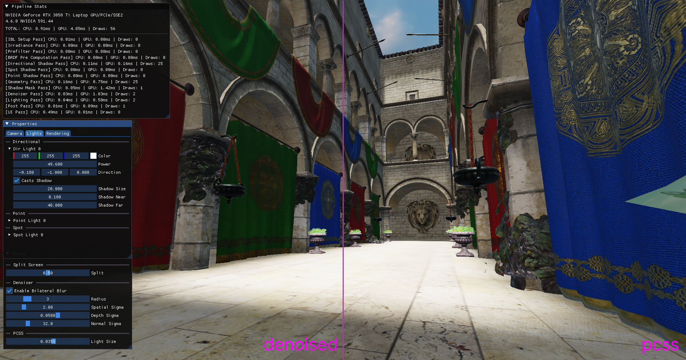
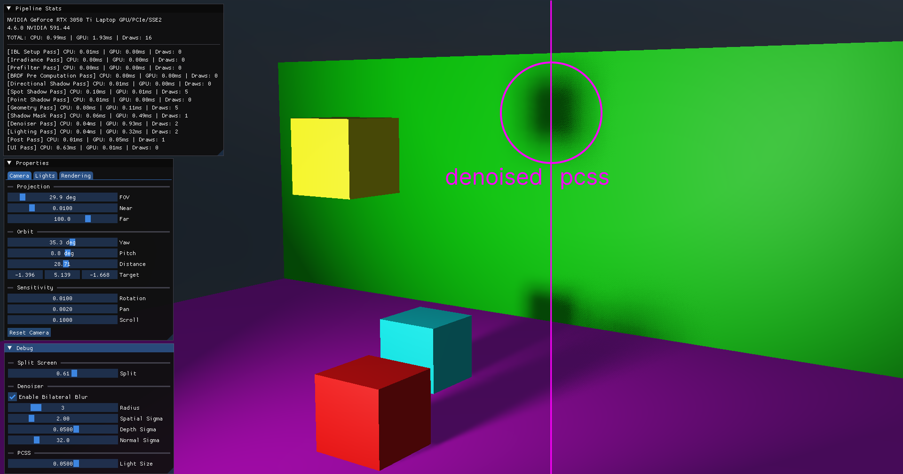

# Denoised Stochastic PCSS

A real-time implementation of Percentage-Closer Soft Shadows (PCSS) using stochastic sampling and a separable edge-aware bilateral denoiser

## Dependencies
- [Bolero](https://github.com/KaindraDjoemena/Bolero)